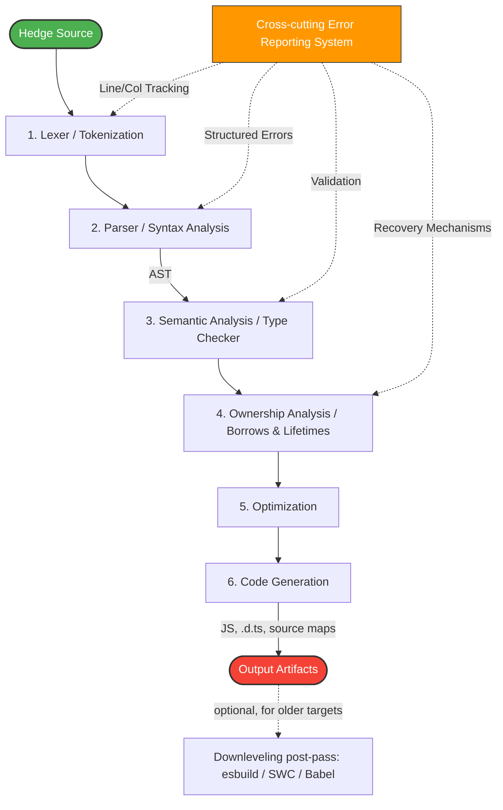

# Compilation Model

The compiler is a pipeline of six stages, with a cross-cutting error-reporting
system that runs alongside the first four.



## 1. Lexer (tokenization)

The lexer reads the source text and produces a stream of tokens, classifying each
run of characters as a keyword, identifier, literal, or symbol.

## 2. Parser (syntax analysis)

The parser consumes the token stream and builds an abstract syntax tree, checking
the program's grammar and structure as it goes. For example,

```hedge
let x = 1 + 2;
```

parses to roughly

```
LetBinding
 ├─ name: x
 └─ value: BinaryExpr(+)
      ├─ 1
      └─ 2
```

The abstract syntax tree is the compiler's intermediate representation of the
program's structure, and the later stages operate on it.

## 3. Semantic analysis

Semantic analysis validates the AST against the language's rules: type checking,
variable resolution against scopes and bindings, read and write rules, function
arity, and the existence of the names a program refers to.

## 4. Ownership analysis

Ownership analysis enforces the rules the source does not state outright —
ownership and move semantics, mutability capabilities, borrows, and lifetimes —
and annotates the AST with the resolved ownership, lifetime, and drop information
that later stages lower into code, such as drop points, drop flags, and boundary
guards. The stage only checks and annotates; it emits no runtime code.

## 5. Optimization

Optimization rewrites the AST for better performance through the usual passes:
constant folding (`2 + 3` becomes `5`), dead-code elimination, and inlining.

## 6. Code generation

Code generation lowers the analyzed AST directly to JavaScript and emits the
`.d.ts` declarations from Hedge's own type model (see
[TypeScript Declaration Generation](0022-typescript-declaration-generation.md)),
along with source maps back to the Hedge source. There is no TypeScript compiler
in the pipeline: Hedge has already type-checked and erased its types by this
stage, so the declaration surface reflects Hedge's semantics rather than anything
inferred from the output. Targeting an older runtime is an optional downleveling
post-pass over the emitted JavaScript, with esbuild, SWC, or Babel, rather than a
required stage; see [Toolchain & Packaging](0024-toolchain-and-packaging.md).

## Error reporting

A cross-cutting error-reporting system tracks line and column positions, produces
structured errors, and provides recovery so that one failure does not mask the
errors after it, giving clear feedback on problems in the source.