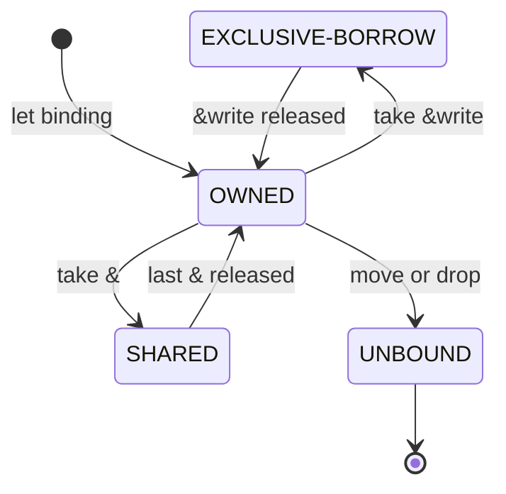

# Execution Model

Hedge programs operate on memory regions rather than on variables or values
directly. A memory region is a runtime entity that holds a value and maintains a
single ownership state for its lifetime; a variable is a named binding to one
such region.

At any point a region is in exactly one of four states:

- **OWNED**: the region is reachable through a single binding, subdivided by
  capability in [Mutability](0004-mutability.md).
- **SHARED**: one or more immutable references (`&`) refer to the region, and no
  binding may mutate it while they live.
- **EXCLUSIVE-BORROW**: a single mutable reference (`&write`) holds the region,
  the owning binding is frozen, and the reference is the only path to the value
  until the borrow ends.
- **UNBOUND**: the region has been moved or invalidated and can no longer be
  accessed.

A region's state determines what may be done with it: whether its value may be
mutated, whether its binding may be rebound, whether further references may be
taken, and whether it may be moved.

A region moves between these states as references are taken and released and as
ownership transfers:

## State invariants

A region is either held exclusively or shared, never both. OWNED and
EXCLUSIVE-BORROW are the exclusive states; SHARED is the shared state; UNBOUND is
neither. SHARED forbids mutation and every operation that presumes exclusive
ownership, because other references may be reading the value. EXCLUSIVE-BORROW
permits mutation through its `&write` reference and freezes the owning binding so
the reference stays the only path to the value. OWNED forbids mutation and
sharing except where the binding's capability grants them. An UNBOUND region
permits nothing.

## Bindings

The binding forms `let`, `let bind`, `let write`, and `let bind write` do not
declare mutability directly. Each sets or transforms the ownership state of the
region it binds and grants the capabilities that later operations are checked
against; the capabilities are described in [Mutability](0004-mutability.md).

## References

A shared reference, `&value`, moves the region into SHARED state. Every binding
that names the region then has read-only access for as long as any shared
reference lives. A mutable reference, `&write value`, moves the region into
EXCLUSIVE-BORROW: at most one may exist at a time, the owner must already hold the
`write` capability, and the owning binding may not be read, written, moved, or
re-borrowed until the borrow ends.

A borrow's extent is inferred from its last use, not its lexical scope. It ends
at the reference's final use, even when that precedes the end of the enclosing
block, so a region is available again as soon as its references are done.

## Moves

Assigning one binding to another transfers ownership of the region to the
destination and leaves the source UNBOUND; the capability state carries across
unchanged. The moved-from binding is unusable, but not because the value was
reclaimed: the underlying JavaScript object is still alive and reachable through
the new owner. The compiler forbids the old binding so that mutation stays
exclusive and `Drop` runs exactly once. A `Copy` type is duplicated rather than
moved, so its source stays usable, which confines move errors to types that own a
resource.
